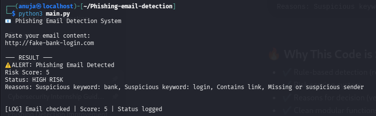
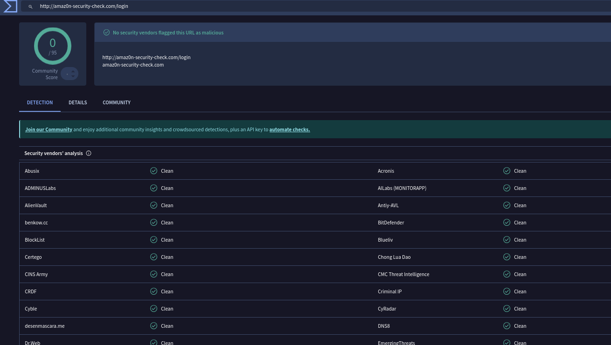
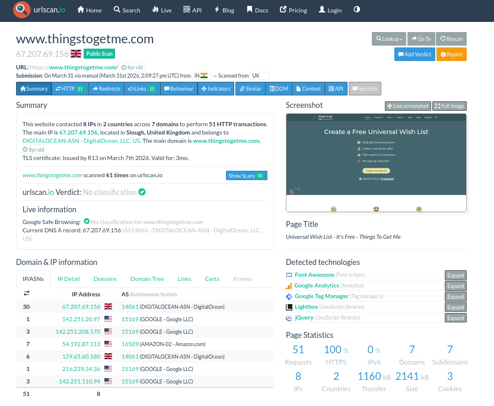

# 📩Phishing Email Detection System with Risk Scoring

## 📌 Description

This project detects phishing emails by analyzing content, identifying suspicious patterns, and assigning a risk score. It also supports external verification using VirusTotal.


## 🚀Features

- Keyword-based phishing detection
- URL detection
- Risk scoring (Low / Medium / High)
- Reason-based analysis
- SOC-style alert output
- External verification using VirusTotal
  

## 📁Project Structure
```
- main.py → Core detection logic
- sample-email.txt → Input email
- analysis.txt → Output report
- system-output.png → Program output
- virustotal-result.png → VirusTotal verification
```

## ⚙️How It Works

1. User inputs email content
2. System checks for:
   - Suspicious keywords
   - Links
   - Sender issues
3. Assigns risk score
4. Generates alert and report


## 🛠️Tools Used

- Python
- Kali Linux
- VirusTotal(for threat verification)
- urlscan(for URL behavior analysis)


## 📊Output Example
```
- HIGH RISK → 🚨⚠️Phishing detected
- MEDIUM RISK → ⚠️Suspicious email
- LOW RISK → ✅Safe email
```
## 📷Output Screenshot




---
## 🚀 Future Enhancements

- Add machine learning-based detection  
- Integrate VirusTotal API  
- Develop GUI interface  
- Implement real-time scanning

## 👩‍💻 Author
Anuja Gurav


